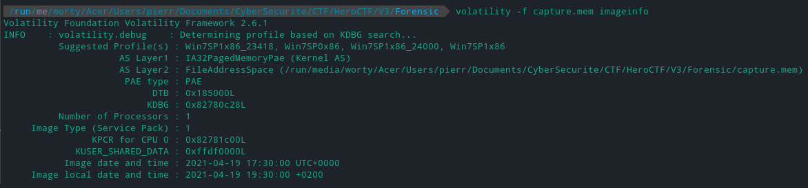
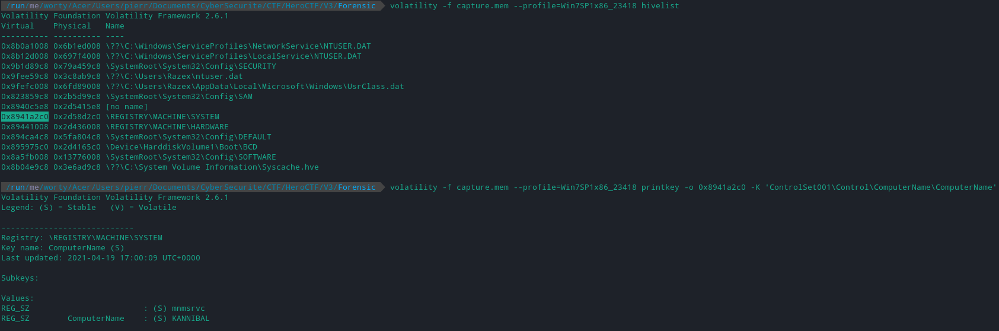

# We need you 1/5

### Category

Forensic

### Description

Interpol and the FBI have been investigating for over a year now. They are trying to get their hands on two hackers very well known for their ransomware and their ultra efficient botnet.

After long months of investigation, they managed to get their hands on one of their servers. But, when they got it back the PC caught fire because of a defense mechanism set up by the two hackers.

The hard drive could not be saved, but they had time to put the RAM in liquid nitrogen and analyze it later.

You know what you have to do!

For this first step, find the name of the PC!

Download, [here](http://chall0.heroctf.fr/Challenge.zip).

Author: **Worty** 
Format: **Hero{Name}**

### Write up

In all the challenges of this series, we must use volatility, allowing us to analyze the memory dump.

First step: Identify the profile to use for volatility.

The profile we are going to use is Win7SP1x86_23418, so we must determine the name of the computer:

### Flag

Hero{KANNIBAL}