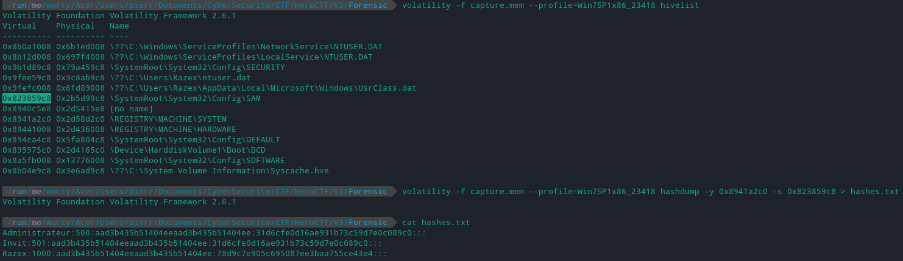

# We need you 2/5

### Category

Forensic

### Description

It must be their team name.

For this second step, find the user's name and password in clear text.

Author: **Worty**

Format: **Hero{Username:Password}**

### Write up

To find the user name and the password, we will have to go to the SAM database, which we can find in the registry.

So we have to find the SYSTEM registry key as well as the SAM registry key, and dumper all the hashes that we can find in it:

So we have the username "Razex", and a hash "78d9c7e905c695087ee3baa755ce43e4".

To retrieve the password, we can use crack station :

### Flag

Hero{Razex:liverpoolfc123}