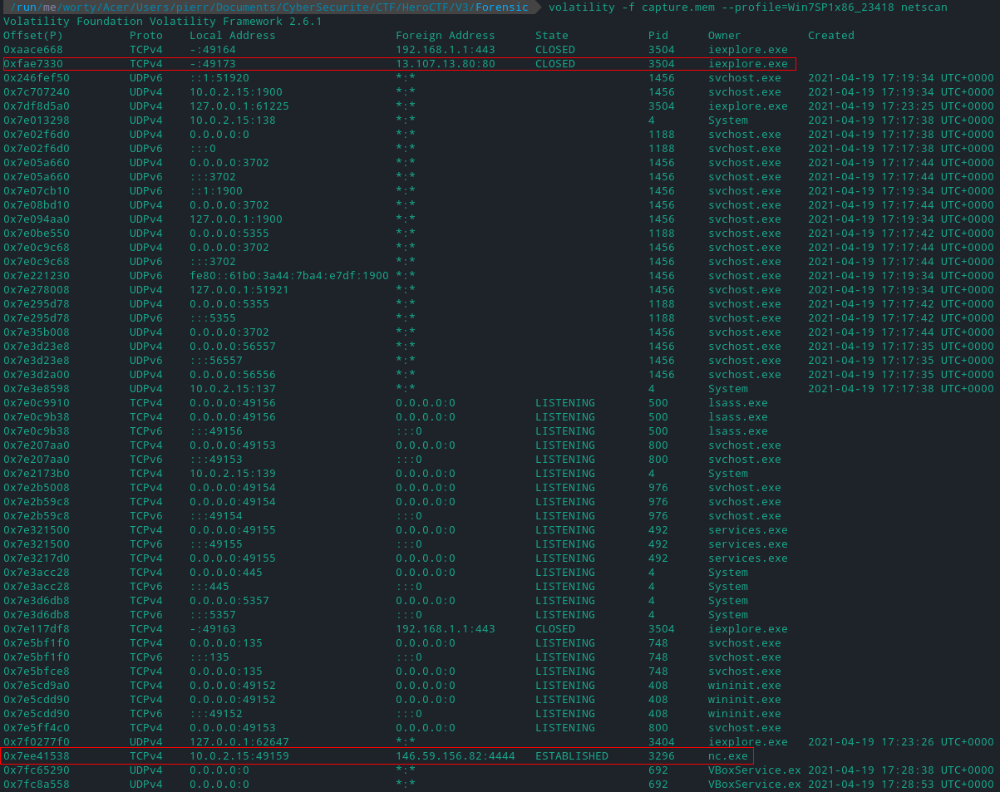

# We need you 3/5

### Category

Forensic

### Description

We know for sure that this server allowed to connect to infected machines. Can you check if a connection was instantiated?

Author: **Worty**

Format: **Hero{IP:Port}**

### Write up

We will first look for the active connections of the machine, to see if one in particular does not jump out at us:

We have two external IP addresses, but one of them needs attention, because one of the two connections is open on port 80, so this one is not interesting.

The other connection is open on 146.59.156.82 on port 4444, with the application "nc.exe", so there is a TCP connection, which must surely be used for exfiltration or command execution.

### Flag

Hero{146.59.156.82:4444}