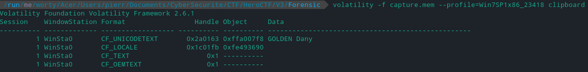
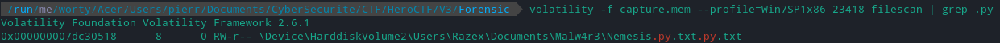
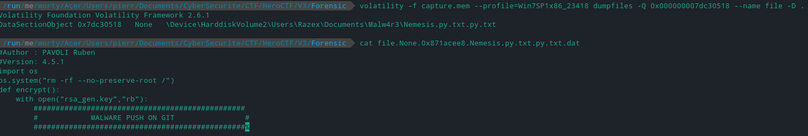

# We need you 4/5

### Category

Forensic

### Description

The FBI and Interpol are desperately looking for the first and last names of the two hackers. 

Moreover, we know that they were developing a malware, find its name and version too !

Find this valuable information!

Author: **Worty**

Format: **Hero{Lastname-Firstname:Lastname-Firstname:NAME-X.X.X}**

### Write up

Looking at what can be retrieved with volatility, we realize that the tool is able to retrieve the clipboard:

So we have a first name: Dany GOLDEN

If we look at the description, we can see that we are asked to find a malware, which is apparently in development. So it is not compiled and must surely be in code form. We can therefore try to list the files open on the machine at the time of the dump:

Here I have directly grep on a .py to avoid that the screen capture is too heavy.

So we have a file named Nemesis.py.txt which was being edited, in the Malw4r3 folder, so we have the name of the malware : Nemesis.

We are now going to recover its contents since it is open:

### Flag

Hero{Golden-Dany/Pavoli-Ruben:Nemesis-4.5.1}