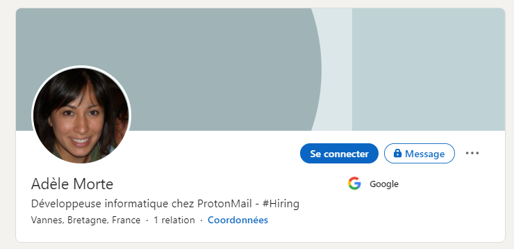
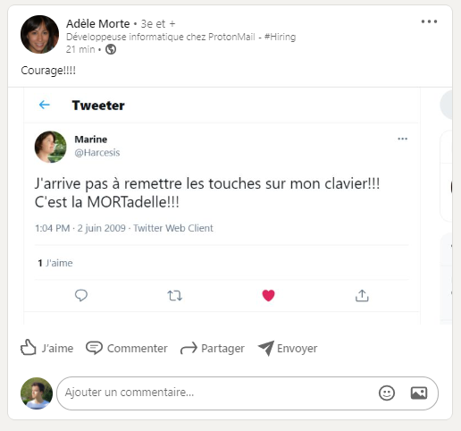
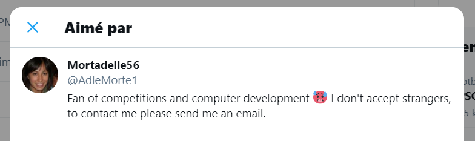
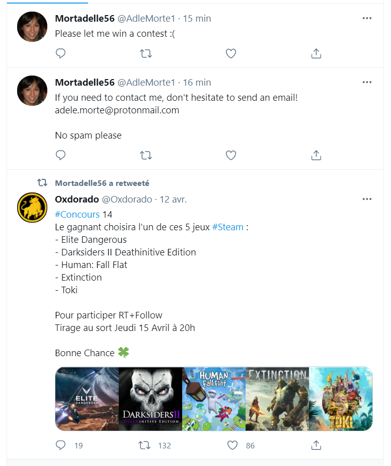

# Good French Charcuterie

### Category

OSINT

### Description

One of our agents has turned over his coat: this puts us in a very delicate situation. Try to compromise her account to find out who she is working for. Use your OSINT and social engineering skills to complete this mission successfully.

**Name : Adèle Morte**

(No need to speak French)

Format : **Hero{}** 
Author : **Thib**

### Write up

It's a pretty basic challenge. Let's start by finding his linkedin profile. 

When we look at the content, we see that she shared a screenshot of a tweet that only she liked. 

By going back to the Twitter account in question, we look at the list of people who have liked it and we find its Twitter account.

We only have to look at the list of her tweets to see that she participates in many competitions and that she also shares her email address. So all we have to do is create a phishing email and make her believe she has won a prize.

### Flag

Hero{FR3NCH_M0R74D3LL35} 
