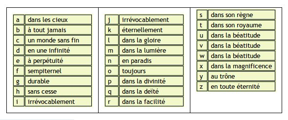

# Holy Abbot

### Category

Steganography / Crypto

### Description

A certain abbot tried to give us a message...

(the message is in lower case)

Format : **Hero{message}** 
Author : **Thib**

**15 points**

### Files

- HolyAbbot.txt

### Write up

It is an encryption that is rarely used because it is quite complex: "Les Ave Maria de Trithème" 

You can use https://www.dcode.fr/ave-maria-tritheme to decode it.

### Flag

Hero{substitution}
