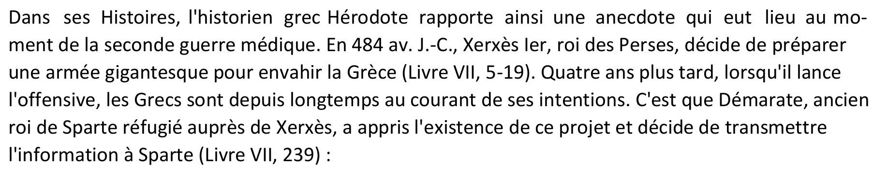

# NicePDF

### Category

Steganography

### Description

Don't think to much ;)

Format : **Hero{}** 
Author : **Thib**

### Files

- NicePDF.pdf

### Write up

Not very complicated, just make a CTRL+A and concatenate all the white charcacter to make the flag.

### Flag

Hero{E4SY_PDF}
