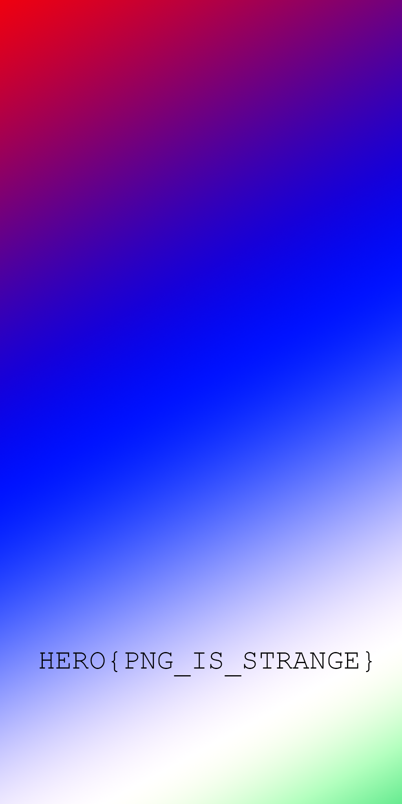

# Rozmiar

### Category

Steganography

### Description

Such a nice colored picture... What can he be hiding?

Format : **Hero{flag}** 
Author : **Thib**

### Files

- Rozmiar.png

#### Solution

This challenge is a little more complicated... You have to know the different png chunks and their use. According to the title, Rozmiar means "size" in Polish. So we have to focus on the size. One option that is not often thought of is that the PNG may have been trimmed. So we can try to increase the displayed size of the image. To do this we can directly modify the IHDR chunk. You can use TweakPNG to make these modifications or directly modify the hex of the file.

The height can be changed from 1024 to 2048 for example.

Then the flag is shown.

### Flag

HERO{PNG_IS_STRANGE}

