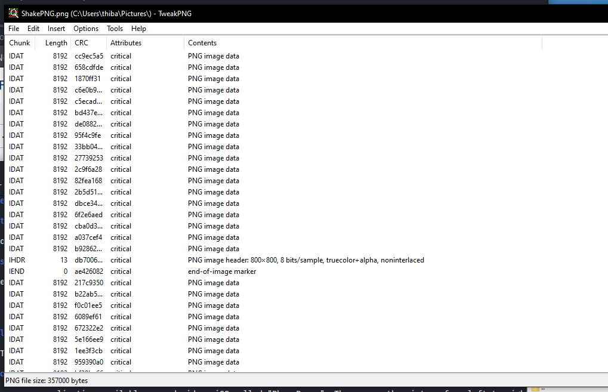

# ShakePNG

### Category

Steganography

### Description

Someone dropped this picture on the floor :( it's all mixed up

Format : **HERO{}** 
Author : **Thib**

### Files

- ShakePNG.png

#### Solution

It's a pretty basic shorthand challenge, just put the header at the top of the file and the IEND at the end. To do this you can use TweakPNG available on windows (yes) to rearrange the chunks.

### Flag

HERO{SH4K3_UR_PNG}

