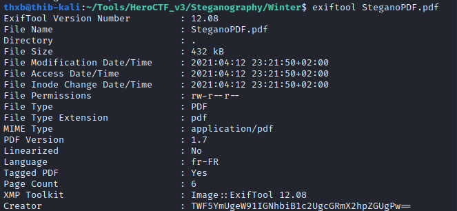
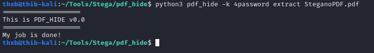
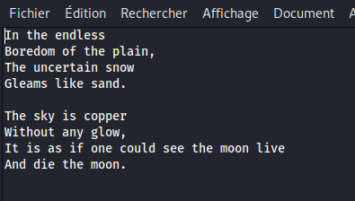
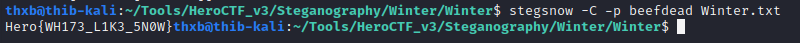

# Winter

### Category

Steganography

### Description

A fairly well-known poet sent this document to a famous publishing house. There is a panic, no one can figure out where the poem is.

Format : **Hero{flag}**<br>
Author : **Thib**

### Files

- SteganoPDF.pdf

### Write up

This challenge is quite complicated. First of all, the document itself must be analysed. In the top right corner, written white on white, we can find two passwords: 

```
beefdead & 4password
```

They will be useful later. Then, when we look at the metadata of the file :



We find a base64 string : This message means that we have to think about how to hide info in a pdf with a password. So we can think about pdf_hide

So we try to extract the data using pdf_hide using one of the two passwords. 
We find a base64 string, which when decoded tells us that we can use pdf_hide.



An archive is extracted named "Winter" with a text document inside.



There is something quite strange about this poem, there are blank characters like tabs or line breaks. Also the poem talks about snow: one thinks directly of stegsnow.

So we extract the data with stegsnow using the second password :



### Flag

Hero{WH173_L1K3_5N0W}
