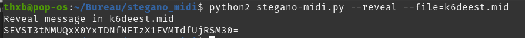

# WolfgangAmadeusMozart

### Category

Steganography

### Description

We have found the first recording of Mozart dating from 1760! Very intelligent for his age, we suspect that he is hiding something... 

Format : **HERO{}** 
Author : **Thib**

### Files

- k6deest.mid.pdf

#### Solution

This kind of file is quite rare and yet it allows to hide messages easily. 

We will use the script available on this GitHub to get the data : https://github.com/maxcruz/stegano_midi

Decode the base64 and we get : HERO{M1D1_F1L3_4R3_QU17_R4R3}

### Flag

HERO{M1D1_F1L3_4R3_QU17_R4R3}

